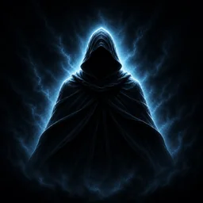

# Canonical emblem reference

This directory contains the visual authority for every future THE LEGENDARY POET emblem iteration.

## Authority

- Reference id: `canonical-hooded-figure-v1`
- Canonical project asset: `brand-emblem-canonical-reference.webp`
- Integrity and source metadata: `brand-reference-manifest.json`
- Macro geometry targets: `brand-reference-contract.json`

The project copy is an uncropped 256×256 optical derivative of the user-supplied 1254×1254 reference. Its hash is pinned by `scripts/validate-brand-reference-contract.ts`. Replacing it requires explicit user approval and a deliberate manifest/hash update.

## Non-negotiable usage

Every brand marathon must keep the reference visible while editing. A candidate must be compared against it at 192, 96, 56, 32 and 16 px through the browser artifact `brand-reference-comparison-matrix.png`.

The previous SVG is never a substitute for this image. The current v8.27 production baseline is **NOT REFERENCE APPROVED**.

## What the reference requires

1. A tall figure whose mantle dominates the composition.
2. A broad pentagonal black face cavern.
3. A relatively small hood, around one third of visible figure height.
4. Long diagonal shoulders and an angular cloak spread rather than a rounded dome.
5. Heavy cloth overlapping near the centre without becoming a thin tie.
6. Three major fold systems: left diagonal, right diagonal and central vertical.
7. A near-symmetric structural core.
8. Continuous icy rim light and a broad spectral/electric aura.

## What must trigger a reset

Do not keep polishing if the candidate develops a large head, narrow droplet face, poncho silhouette, artificially split collar, arbitrary body asymmetry or decorative seams without correct macro geometry. Those are stop conditions requiring a geometry reset.
